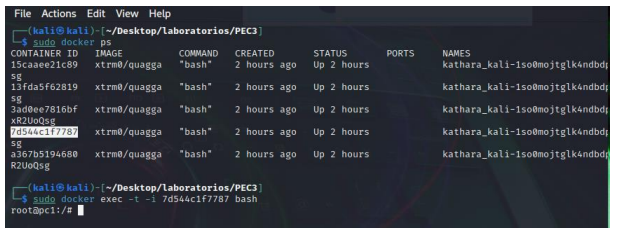
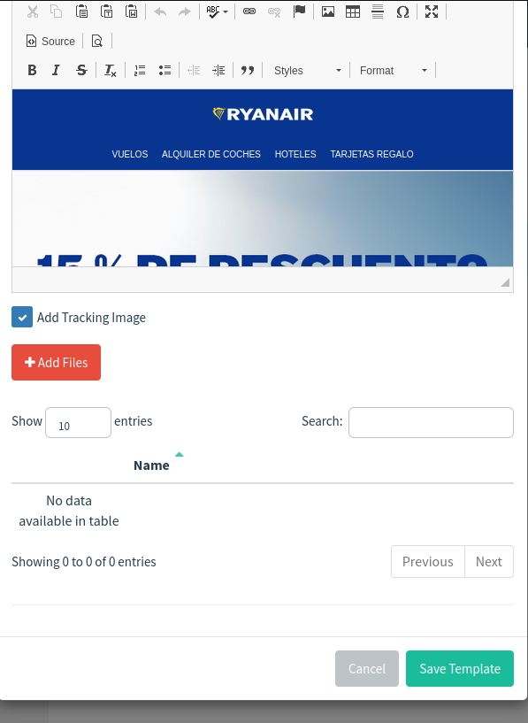
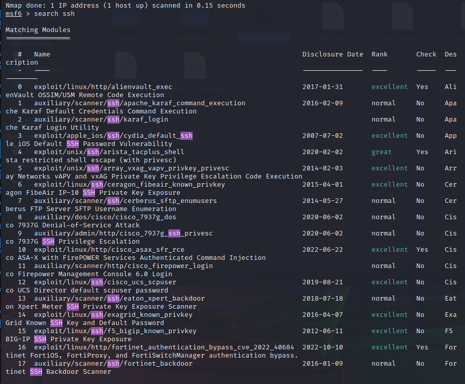

# M1.870 - Fundamentos de ciberseguridad.

# José Enrique Rodríguez González.

# PRACTICA 2.

---

## Indice.

- [Enunciado.](#enunciado)
- [Actividad.](#actividad)
- [Pregunta 1.](#pregunta-1)
- [Pregunta 2.](#pregunta-2)
- [Pregunta 3.](#pregunta-3)
- [Pregunta 4.](#pregunta-4)
- [Pregunta 5.](#pregunta-5)
- [Preparación del enunciado y de la actividad.](#preparación-del-enunciado-y-de-la-actividad)
- [Respuesta a la pregunta 1.](#respuesta-a-la-pregunta-1)
- [Respuesta a la pregunta 2.](#respuesta-a-la-pregunta-2)
- [Respuesta a la pregunta 3.](#respuesta-a-la-pregunta-3)
- [Respuesta a la pregunta 4.](#respuesta-a-la-pregunta-4)
- [Respuesta a la pregunta 5.1.](#respuesta-a-la-pregunta-51)
- [Respuesta a la pregunta 5.2.](#respuesta-a-la-pregunta-52)
- [Respuesta a la pregunta 5.3.](#respuesta-a-la-pregunta-53)

---

## Enunciado.

En esta segunda y última práctica usaremos también el mismo entorno de Kathará de la PEC 3 en algunos de los ejercicios (no en todos). Antes de continuar  debemos de realizar algunas puntualizaciones:

- Para alguna de las actividades posteriores será necesario iniciar el entorno de Kathará en modo privilegiado. Por este motivo se pidió en la PEC3 anterior como pregunta. Se puede realizar de la siguiente manera:

~~~
sudo kathara lstart --privileged

sudo docker ps

sudo docker exec -t -i identificador_container_ bash
~~~

También es posible abrir todos los terminales directamente con el bucle siguiente escrito en Bash:

~~~
for i in $(docker ps -q)

do xterm -e docker exec -it $i bash &

done
~~~

- Comentar que Kathará no tiene persistencia así que recomendamos no cerrar el laboratorio y guardar el estado de la máquina virtual.

- Otra puntualización es que, para que las máquinas internas de la red puedan acceder correctamente a Internet deberemos de suprimir la regla siguiente en la máquina firewall1.

> 1: Este es el primer semestre que usamos Kathará y nos estamos encontrando con situaciones diversas. Estamos en contacto con los desarrolladores para profundizar un poco más. Por ejemplo: https://github.com/KatharaFramework/Kathara/issues/211.

~~~
iptables -t nat -D PREROUTING -p tcp --dport 80 -j DNAT --to 5.5.5.2
~~~

Esta regla eliminará la redirección del puerto 80 desde la máquina Kali. Si deseamos acceder desde la máquina Kali a este puerto podemos añadirla de nuevo con:

~~~
iptables -t nat -A PREROUTING -p tcp --dport 80 -j DNAT --to 5.5.5.2
~~~

> Añadimos nuevamente el diagrama de red implementado a modo de recordatorio. Es el mismo que el de la PEC3.

[Volver al indice.](#indice)

---

## Actividad.

Demostrad con capturas de pantalla de vuestro entorno las operaciones siguientes y responded a todas las preguntas.

Nota: aseguraros que aparezca en la shell vuestro nombre de usuario de la UOC en todas las capturas de pantalla. Podéis utilizar el comando:

~~~
export PS1=(gfarrasb)$PS1
~~~

Adicionalmente proporcionad una explicación para justificar qué realiza cada captura:

[Volver al indice.](#indice)

---

## Pregunta 1.

El administrador de red, conjuntamente con la Dirección de la empresa, han considerado que sería una buena idea realizar una acción de concienciación de phishing para todos trabajadores y empleados. Implementad una campaña de concienciación de phishing con el programa `Gophish`. Esta actividad está fuera de Kathará y, de hecho, podéis hacerla en el entorno que queráis. Demostrad que al menos un trabajador cae en el ataque de phishing y podéis ver su usuario y contraseña **(1.5 puntos)**.

[Volver al indice.](#indice)

---

## Pregunta 2.

El administrador de red quiere investigar si es posible lanzar un ataque de persistencia de clave SSH mediante `metasploit`2 contra PC3 (se trata, en concreto, del módulo llamado SSH Key persistence - This module will add an SSH key to a specified user to allow remote login via SSH at any time) Aseguraros que, aunque user3 cambie la contraseña, el administrador podrá acceder igual a la máquina mediante la clave generada vía este módulo de metasploit **(1.5 puntos)**.

> 2: Metasploit es una herramienta incorporada ya en Kali Linux que permite ejecutar exploits conocidos contra una máquina remota. No es necesario instalar nada ya que Kali la lleva por defecto.

[Volver al indice.](#indice)

---

## Pregunta 3.

El administrador de red ha descubierto que el servidor web de main.py contiene un bug que permite un Directory Transversal Attack. Se os pide arreglar el código de este servidor web escrito en Python para solucionarlo. El servidor web debería de poder entregar solamente ficheros de la carpeta de donde reside. **(1 punto)**.

[Volver al indice.](#indice)

---

## Pregunta 4.

Ahora resulta que el usuario de PC2 está enfadado contra el usuario de PC3 así que decide atacarlo. Ejecutará un ataque de DNS Spoofing contra una de las webs preferidas del usuario de PC3. Implementad un ataque de DNS spoofing usando la herramienta de terminal `ettercap` contra PC3 que use el dominio que consideréis. **(2 puntos)**

[Volver al indice.](#indice)

---

## Pregunta 5.

El usuario de PC3 nota que algo pasa en su ordenador y empieza a defenderse. Aplicará las siguientes protecciones:

1. Quiere evaluar el uso de unidades cifradas. Demostrad que podéis crear una disco cifrado mediante la herramienta `zulucrypt`. Esta actividad está fuera de Kathará e incluso de PC3. Implementadlo en la Kali nativa proporcionada. **(1 punto)**.

2. Quiere detectar mediante snort todas las conexiones SYN que entren en su máquina y ver una alerta por pantalla.**(1 punto)**.

3. Como ya duda de sus compañeros aplicará una regla en el cortafuegos (concretamente, usará la herramienta de terminal iptables) que solamente permita conexiones SSH desde fuera, no desde las máquinas internas (ni desde PC1 ni desde PC2, solamente desde firewall). **(1 punto)**.

[Volver al indice.](#indice)

---

## Preparación del enunciado y de la actividad.

Procedemos a importar la VM de la PEC 3.

Una vez importado, ya que la maquina huésped que dispongo tiene bastante potencia, procedo a aprovecharla ampliando RAM y uso de CPU's

Procedo a abrir la terminal desde la carpeta de la PEC 3 y ejecuto el siguiente comando que se indica en la preparación de la actividad, de modo que los pantallazos son personalizados.

~~~
export PS1="(jrodriguezgonzalez6)$PS1"
~~~

Procedemos a iniciar el entorno de Kathará en modo privilegiado, ejecutando en terminal los siguientes comandos:

~~~
sudo kathara lstart --privileged

sudo docker ps
~~~

El tercer comando lo considero innecesario realizarlo porque debajo del container id dice quien es cada uno.

- En el container id `eb148e555dff`podemos ver la siguiente etiqueta de names kathara_kali-1so0mojtglk4ndbdpjxg_<u>**pc2**</u>_qUYEvZx4QtMbMsxR2UoQsg

- En el container id `fd051bfec9b8`podemos ver la siguiente etiqueta de names kathara_kali-1so0mojtglk4ndbdpjxg_<u>**webserver**</u>_qUYEvZx4QtMbMsxR2UoQsg

- En el container id `7d6e85d3d002`podemos ver la siguiente etiqueta de names kathara_kali-1so0mojtglk4ndbdpjxg_<u>**pc3**</u>_qUYEvZx4QtMbMsxR2UoQsg

- En el container id `4b82a915d1cc`podemos ver la siguiente etiqueta de names kathara_kali-1so0mojtglk4ndbdpjxg_<u>**pc1**</u>_qUYEvZx4QtMbMsxR2UoQsg

- En el container id `c9e0381c2ebc`podemos ver la siguiente etiqueta de names kathara_kali-1so0mojtglk4ndbdpjxg_<u>**firewall**</u>_qUYEvZx4QtMbMsxR2UoQsg

De este modo, quedan correctamente identificados, para entrar en la consola de cada uno de ellos procederemos según lo indicado en el enunciado.

[Volver al indice.](#indice)

---

## Respuesta a la pregunta 1.

### Introducción.

Para cumplimentar este ejercicio, debo implementar una campaña de concienciación de phishing utilizando el programa Gophish. Nos aseguraremos de seguir las políticas y regulaciones éticas y legales cuando realices este tipo de actividades, como en este caso, estamos realizando una acción conjunta con la Dirección de la empresa, presumimos que tenemos la venia para realizarlo.

En esta pregunta desarrollaré los siguientes pasos:
1. [Instalación de Gophish.](#instalación-de-gophish)
2. [Configuración de la campaña.](#configuración-de-la-campaña)
3. [Ejecución de la campaña y recolección de datos](#ejecución-de-la-campaña-y-recolección-de-datos)

### Instalación de Gophish.

- Instalaremos en la VM de kali, `Gophish` desde la [web oficial de Gophish](https://getgophish.com/)

- Hacemos click en descargar y nos redirige al repositorio [github de Gophish](https://github.com/gophish/gophish/releases)

- Descomprimimos y copiamos la carpeta en Documentos, para este paso, nos he procedido a buscar en YouTube un tutorial relativo a la instalación de `Gophish` usando el siguiente enlace de [YouTube](https://www.youtube.com/watch?v=lEX0OTrobn4&ab_channel=FaceITNet).

- Damos permiso para poder ejecutar el binario con `sudo chmod +x gophish`

- Por ultimo ejecutamos el binario

En el momento que nos aparezca en la consola `level=info msg="Starting admin server at https://127.0.0.1:3333"`, significa que `Gophish` se está ejecutando correctamente.

### Configuración de la campaña.

Para estas acciones, seguiremos usando como fuente el video de [YouTube](https://www.youtube.com/watch?v=lEX0OTrobn4&ab_channel=FaceITNet) anteriormente indicado.

Una vez instalado el programa procederemos con la campaña, para ello primero de ello accederemos a la web `https://127.0.0.1:3333`, aceptaremos los riesgos que indican en la pantalla.

A continuación entraremos en el login del la aplicación, para saber el admin y pass nos iremos a unos de los mensajes info que tenemos en la consola con la que hemos ejecutado `Gophish` que nos dice lo siguiente:

~~~
level=info msg="Please login with the username admin and the password a866395e00f77bcd"
~~~

- Procedemos a ingresar user y pass.

Procedemos a cambiar la contraseña a otra nueva

Una vez accedido a la aplicación, se procede a realizar el perfil falso, para ello entramos en `sending profile`, una vez dentro procedemos a rellenar los datos. En este caso usaremos un mail de Hotmail, como prueba, introducimos la configuración tal y como indica en la siguiente imagen.

Ahora pasaremos a realizar un mail de prueba para comprobar que todo funciona. En este caso procederemos a realizarlo a la cuenta personal de email de la UOC. Rellenamos los datos y hacemos click en enviar.

Dentro del nuestro buzón de la UOC, se puede ver el correo recibido.

A continuación pasamos al apartado de landing page, que es como crear la `website fake`, hacemos crear una nueva pagina. Lo vamos a configurar para que de tal manera simule una pagina web de Facebook, la victima ingresará unos datos y posteriormente redirigirá a otra web, la cual simulará nada mas que un front que solo diría, has sido victima de un phishing de tu empresa. Tendremos activado los tic de capturar password y la información de inicio de sesión.

A continuación procederemos a hacer una plantilla de email, en este caso voy a usar una plantilla de ofertas de Ryanair. Para ello, lo hemos importado desde el original recibido. Activaremos el tick de add tracking Image y procederemos a guardar.

Por ultimo añadiremos el grupo de correo, en nuestro caso, volveremos a mandarlo al correo de la UOC. Procedemos a rellenar los datos y guardamos los cambios.

### Ejecución de la campaña y recolección de datos.

Para comenzar a ejecutar la campaña, solo nos queda unificar todo en el apartado campaña. Seleccionamos los datos, y en URL, ponemos localhost para que no salga al exterior.

Entramos desde la maquina de Kali en nuestro correo electrónico, haciendo un ambiente simulado ya que todo lo hemos montado en la maquina de kali.

En nuestro caso hemos entrado en la parte de SPAM para ver el mail.

Por otro lado, podemos ver que en dashboard de la campaña, el email ha sido enviado.

Procedemos a abrir el correo y simulamos que somos victima de phishing.

En el dashboard de gophish, podemos ver la evolución y una linea del tiempo de las acciones realizadas.

Como las credenciales han sido falsas, he decidido hacer una nueva campaña y remitir mis credenciales de acceso a al portal de la uoc, ya que he usado ahora esa cuenta en la nueva campaña para comprobar su funcionamiento.

A continuación, haremos click en replay credentials y seleccionaremos a donde quieres que re remitan las credenciales.

Hacemos click en ok

En este caso, como la sesión esta caducada, da fallo de acceso, por lo que el token esta ya inactivo.

[Volver al indice.](#indice)

---

## Respuesta a la pregunta 2.

Para la realización de este ejercicio, usare de fuente el siguiente video del canal de YouTube de [DigiParty League](https://www.youtube.com/watch?v=B63ugYTEFtE&t=69s&ab_channel=DigiPartyLeague)

Iniciamos en la VM de kali Metasploit

Ahora, procederé a comprobar de que tengo acceso a pc3 desde la VM de kali

Nosotros, para acceder al ambiente de Kathará desde la VM de kali, accederemos a traves del firewall, por tanto nuestra victima sera el firewall.

procedemos a hacer un `nmap` al firewall obteniendo la siguiente respuesta:

Podemos observar que tenemos el puerto 22 a la escucha. Ahora buscaremos vulnerabilidades del tipo ssh con el comando `search ssh`.

Dentro de este tipo de payload disponibles, los que nos interesan son los de key persistence.

Usaremos el relativo a windows, ya que kathará funciona bajo Kali. de modo que usaremos en este caso ejecutando el comando `use post/linux/manage/sshkey_persistence`. Posteriormente procederemos a ver lo que necesita el payload para funcionar con el comando `info`.

En nuestro caso, setearemos la sesión y el user. Tal y como se indica en la siguiente imagen y volvemos a comprobar.

En nuestro caso, nos ha dado un fallo

~~~
Msf::OptionValidateError The following options failed to validate: SESSION
~~~

Esto se debe a que necesitamos obtener una sesión activa en la máquina objetivo. Esta sesión podría obtenerse, por ejemplo, explotando alguna vulnerabilidad en la máquina objetivo utilizando un módulo de exploit de Metasploit. En este caso usaremos el exploit de `auxiliary/scanner/ssh/ssh_login`tal y como indica el video citado como fuente.

Procedemos a configurar el auxiliary con los datos necesarios que ya disponemos y seteamos VERBOSE a true.

procedemos a ejecutar con el comando `exploit` o `run`

En nuestro caso nos ha dado el siguiente error:

~~~
[-] No users found with a .ssh directory
~~~

Esto se debe a que en sistemas Unix y Linux, el directorio .ssh en el directorio home de un usuario es donde se almacenan las claves SSH del usuario. Si este directorio no existe, es posible que el usuario user3 nunca haya utilizado SSH.

Procedemos a realizar los siguientes comandos desde terminal.

Este cambio ha seguido dando problemas por lo que se ha procedido a buscar por internet, encontrando la web de [infosecmatter](https://www.infosecmatter.com/metasploit-module-library/?mm=post/windows/manage/sshkey_persistence) donde nos recomienda ejecutar el comando `set createsshfolder true`, consiguiéndose ejecutar el exploit correctamente.

Ahora con la sesión anteriormente iniciada, procedemos a cambiar la pass de user3.

Procedemos a volver a ejecutar comandos en metasploit, procedemos a loguearnos con la pubkey anterior. Para ello ejecutaremos el comando `use auxiliary/scanner/ssh/ssh_login_pubkey`

Como podemos observar en el info, necesitamos setear `RHOSTS`, pero también setearemos `KEY_PATH` y `USERNAME`.

Por ultimo procedemos a ejecutar el exploit, resultando satisfactorio.

[Volver al indice.](#indice)

---

## Respuesta a la pregunta 3.

El ataque de Directory Transversal, también conocido como Path Traversal, se produce cuando un atacante manipula variables que hacen referencia a rutas de archivos con la intención de acceder a archivos y directorios que están fuera del directorio de trabajo previsto.

En nuestro caso el código del main.py que esta alojado en el `webserver` es el siguiente:

~~~python
import os
from http.server import BaseHTTPRequestHandler, HTTPServer
from urllib.parse import urlparse, parse_qs

class FileHandler(BaseHTTPRequestHandler):
    def do_GET(self):
        parsed_path = urlparse(self.path)
        query_params = parse_qs(parsed_path.query)
        file_path = query_params.get('file', [''])[0]

        if not file_path:
            self.send_response(400)
            self.end_headers()
            self.wfile.write(b'Missing file parameter')
            return

        if not os.path.exists(file_path):
            self.send_response(404)
            self.end_headers()
            self.wfile.write(b'File not found')
            return

        with open(file_path, 'rb') as f:
            file_content = f.read()

        self.send_response(200)
        self.send_header('Content-type', 'text/plain')
        self.end_headers()
        self.wfile.write(file_content)

if __name__ == '__main__':
    server_address = ('', 8000)
    httpd = HTTPServer(server_address, FileHandler)
    httpd.serve_forever()

~~~

Para solucionarlo, se debe insertar las siguientes lineas entre `if not file_path:` y `if not os.path.exists(file_path):`

~~~python
absolute_path = os.path.abspath(file_path)

server_dir = os.path.abspath(os.path.dirname(__file__))
if not absolute_path.startswith(server_dir):
    self.send_response(403)
    self.end_headers()
    self.wfile.write(b'Access denied')
    return

~~~

Con `absolute_path = os.path.abspath(file_path)`, se calcula la ruta absoluta del archivo en cuestión, mientas con `server_dir = os.path.abspath(os.path.dirname(__file__))`y el siguiente condicional lo que hacemos es verificar si la ruta absoluta comienza con el directorio del servidor.

El archivo main.py debe de quedar de la siguiente manera:

~~~python
import os
from http.server import BaseHTTPRequestHandler, HTTPServer
from urllib.parse import urlparse, parse_qs

class FileHandler(BaseHTTPRequestHandler):
    def do_GET(self):
        parsed_path = urlparse(self.path)
        query_params = parse_qs(parsed_path.query)
        file_path = query_params.get('file', [''])[0]

        if not file_path:
            self.send_response(400)
            self.end_headers()
            self.wfile.write(b'Missing file parameter')
            return

        # Calcula la ruta absoluta del archivo
        absolute_path = os.path.abspath(file_path)

        # Verifica si la ruta absoluta comienza con el directorio del servidor
        server_dir = os.path.abspath(os.path.dirname(__file__))
        if not absolute_path.startswith(server_dir):
            self.send_response(403)
            self.end_headers()
            self.wfile.write(b'Access denied')
            return

        if not os.path.exists(file_path):
            self.send_response(404)
            self.end_headers()
            self.wfile.write(b'File not found')
            return

        with open(file_path, 'rb') as f:
            file_content = f.read()

        self.send_response(200)
        self.send_header('Content-type', 'text/plain')
        self.end_headers()
        self.wfile.write(file_content)

if __name__ == '__main__':
    server_address = ('', 8000)
    httpd = HTTPServer(server_address, FileHandler)
    httpd.serve_forever()
~~~

[Volver al indice.](#indice)

---

## Respuesta a la pregunta 4.

Ettercap es una herramienta de auditoría de red ampliamente utilizada para la interceptación activa y pasiva de comunicaciones en una red. Para ejecutar un ataque de DNS spoofing con Ettercap, necesitaremos modificar el archivo etter.dns (la configuración del DNS spoofing para Ettercap) y luego iniciar el ataque utilizando la interfaz de la terminal.

Para realizar este ejercicio, primero me tengo que colocar en el firewall y abrir el firewall para poder acceder al exterior e instalar ettercap en pc2.

Procedemos a cambar la config del firewall.

Entramos en pc2 actualizamos e instalamos ettercap.

A continuación procedemos a modificar el archivo alojado en de google, cuya ip es en España 142.250.185.3, quedando el archivo como queda.

Nos metemos en PC3 y lo que vamos a hacer es hacer ping a microsoft.com, donde observamos que la ip es 20.70.246.20.

ahora volvemos a pc2, donde tenemos instalado ettercap y lanzamos el ataque.

* -T: indica el modo de texto.
* -q es para el modo silencioso.
* -i eth0 selecciona la interfaz de red.
* -P dns_spoof selecciona el complemento de DNS spoofing
* -M arp:remote inicia un ataque ARP spoofing contra la víctima y el router, y /1.2.3.4// y /1.2.3.1// son las direcciones IP de la víctima y el router, respectivamente.

Lanzamos el ataque:

Entramos en pc3 e intentamos hacer ping a microsoft.com

Podemos ver que ahora la dirección ip ha cambiado a 142.250.185.3.

Por otro lado en la consola de pc2, nos aparece lo siguiente.

Por ultimo para comprobar que redirige a google procedemos a acceder a esa dirección IP, abriendo la consola de red de herramientas del desarrollador. En este caso podemos ver que 142.250.185.3 nos da un estatus del tipo 301, el cual significa que nos redirige a www.google.com tal y como aparece en la siguiente linea con un status 200,

[Volver al indice.](#indice)

---

## Respuesta a la pregunta 5.1.

Vamos a proceder primero a instalar zulucrypt, para ello introducimos los siguientes comandos en la terminal de kali:

~~~
sudo apt update

sudo apt-get install zulucrypt-cli zulucrypt-gui
~~~

Ahora apagaremos kali para añadir un disco duro sin formatear dentro de la VM de Kali.

Procedemos a abrir la aplicación gparted y damos formato al disco duro insertado.

Arrancamos la aplicación con el comando `zuluCrypt-gui`.

A continuación, hacemos clic en create... Encrypted Container y a Hard Drive.

Seleccionamos el único disco duro `/dev/sdb1`, hacemos click en open

Aceptamos las advertencias de que podemos perder toda la documentación de este disco duro.

A continuación, se inicia el proceso de cifrado.

Por ultimo introducimos una contraseña.

Ahora procederemos a intentar acceder a el desde la terminal, y nos dice que el directorio no existe, solo podemos acceder desde la aplicación `zuluCrypt`.

Para ello, entraremos y haremos click en Open... Volume Hosted in A Hard Drive.

Seleccionamos la unidad, previo a su apertura, se procede a escribir la contraseña

Una vez escrita la contraseña, se podrá acceder a la unidad como con cualquier otra unidad sin cifrar.

[Volver al indice.](#indice)

---

## Respuesta a la pregunta 5.2.

---

## Respuesta a la pregunta 5.3.

